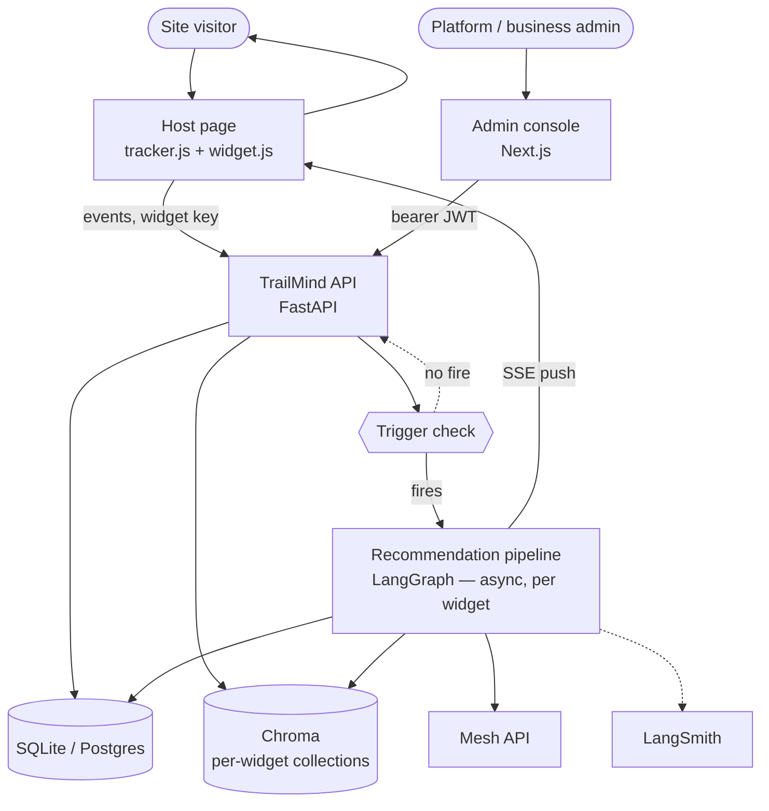
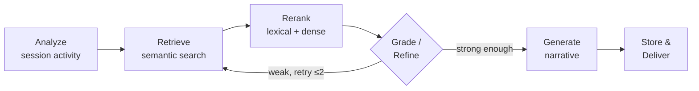

# TrailMind

**A multi-tenant, embeddable behavioral recommendation platform.**

A site embeds two `<script>` tags. TrailMind then watches the trail a visitor leaves through that
site's own catalog — views, searches, comparisons, dwell time — decides when there's enough signal
to act, retrieves relevant catalog items via RAG + vector search, and surfaces a grounded,
comparison-driven recommendation back through an embeddable chat-bot widget, before the visitor
leaves.

Originally built for the Krish Naik Hackathon 2026 as a single-tenant AI-model-catalog demo (see
[`docs/design/00-Domain-Decision.md`](docs/design/00-Domain-Decision.md) for that history), then
converted post-hackathon into the multi-tenant platform described below — see
[`docs/design/09-Platform-Pivot-Decision.md`](docs/design/09-Platform-Pivot-Decision.md) for the
pivot decision and [`docs/design/10-Widget-Architecture.md`](docs/design/10-Widget-Architecture.md)
for the current widget-scoped architecture (the platform's actual state today).

---

## What's inside

**Multi-tenant, multi-widget isolation.** Every tenant (a company embedding TrailMind) can run
several independent widgets (e.g. "Credit Cards" vs "Personal Loans"), each with its own API key,
allowed-origin allowlist, catalog scope, and Chroma vector-store collection — so recommendations
for one product line can never leak into another, even within the same tenant.

**A two-file embed.** A tracker snippet (`tracker.js`) batches behavioral events client-side and
never calls an LLM directly; a widget snippet (`widget.js`) renders the chat-bot launcher. Both
authenticate with the same per-widget key, and the admin console generates both `<script>` tags
pre-filled with that key the moment a widget is created.

**Pluggable catalog ingestion**, per widget: manual entry (admin console CRUD, single item or
bulk CSV/JSON upload), a feed/API pull on a schedule, or a DOM-scrape adapter that prefers
schema.org/JSON-LD product markup and falls back to configured CSS selectors. A scraped row starts
`pending_review` and is excluded from retrieval until an admin approves it; a feed sync failure
keeps serving the last-known-good catalog and flags `sync_stale` instead of going empty.

**Behavioral tracking that doesn't spam the LLM.** Views, searches, comparisons, and dwell time
batch client-side. A cheap event-count/cooldown check decides when there's enough signal to
actually run the agent — ingestion stays cheap even under load.

**A real 6-node LangGraph pipeline** — `analyze → retrieve → rerank → grade/refine → generate →
store` — not a single prompt, scoped to one widget's catalog only. Retrieval gets a bounded retry
(max 2) when it comes back weak, and `generate` — the only node that calls Mesh — fires at most
once per trigger regardless of how many retries that takes.

**Grounded, not generic, recommendations.** Every fact, number, and comparison in a recommendation
is computed in Python from retrieved catalog data; the LLM only handles narrative framing — it
never asserts a spec, price, or comparison itself. A "why this" tag on each candidate is computed
deterministically from session evidence, never canned text.

**Real-time delivery.** A fired trigger pushes to the visitor's open widget over SSE
(`GET /api/widget/stream`) within seconds; a visitor whose connection can't sustain SSE falls back
to polling `GET /api/recommendations/latest`, so a transport hiccup means slightly delayed
recommendations, never none.

**Onboarding readiness gate (TEN-8).** A widget stays dark on the host page until it has both a
verified tracker event and at least one approved, vector-synced catalog item — an empty or broken
bot on a tenant's real customer page is a worse failure than a slightly longer setup flow.

**A Next.js admin console** for both roles: a platform admin approves/rejects tenant signups and
manages tenants; a business admin manages their tenant's widgets (create, rotate/revoke keys,
configure feed ingestion, get the embed snippet), catalog (widget-scoped CRUD + bulk upload +
ingestion status), and an overview (usage totals, live activity, feedback sentiment, an onboarding
nudge when nothing's tracked yet).

**A feedback loop that actually closes.** 👍/👎 on any recommendation re-ranks future retrieval
with an asymmetric penalty, scoped to queries genuinely similar to the one the rating was given
under — so one bad match can't wrongly suppress an item that's right for a different query.

**Full observability.** Every pipeline run traces through LangSmith (when configured), with the
admin console separating our own step latency from LangGraph's internal tracing overhead and
rolling up real Mesh cost/token/latency straight from stored data.

---

## Architecture

FastAPI serves the JSON API only; the Next.js frontend is a fully separate app talking to it over
bearer-token auth. Per widget, two decoupled loops share the same storage: a synchronous
interaction loop that never calls an LLM, and an asynchronous recommendation loop that does,
exactly once per trigger.



The recommendation pipeline itself is a real LangGraph graph — six independently testable nodes,
with a bounded retry loop when retrieval comes back weak, scoped to one widget's catalog:



See [`docs/design/10-Widget-Architecture.md`](docs/design/10-Widget-Architecture.md) for the
widget-scoping details (auth, isolation, readiness gate) and
[`docs/design/09-Platform-Pivot-Decision.md`](docs/design/09-Platform-Pivot-Decision.md) for why
the platform generalized beyond one AI-model-catalog tenant.

---

## Key decisions & trade-offs

| Decision | Choice | Trade-off |
|---|---|---|
| Isolation unit | Widget, not tenant | A tenant with several product lines gets clean recommendation isolation, at the cost of one more entity to manage per tenant. |
| Widget/tracker auth | Per-widget key (`WidgetApiKey`), breaking cutover from tenant-wide keys | No dual-auth transition period was needed (no production tenants embedded yet) — but this is a hard cutover, not backward compatible with any pre-M5 integration. |
| Admin console | Separate Next.js app over a JSON API, not server-rendered same-origin | More moving parts (two deployables, CORS/bearer auth) in exchange for a real component framework and independence from the API's deploy cadence. |
| Catalog ingestion | Three pluggable adapters (manual/feed/scrape) per widget | More adapter code to maintain, but matches how differently technical real tenants actually are. |
| Real-time transport | SSE with polling fallback, not WebSocket | Push is one-directional (widget follow-up Q&A is a separate `POST`), so SSE's simpler HTTP model and built-in reconnect cover it without full duplex. |
| LLM cost control | ≤1 Mesh call per trigger, never blocking | Ingestion stays ~50ms even under load — enforced by the graph's structure, not a convention. |
| Vector store | Chroma, local file, one collection per widget | Zero external account/API key needed; collection-per-widget is the actual isolation boundary. |
| Feedback | Context-scoped, not global | A bad match on one query can't wrongly suppress an item that's right for a different one. |

---

## Quick start

Backend:

```bash
git clone https://github.com/leeladesai/smartreco-hackathon.git
cd smartreco-hackathon
uv sync
source .venv/bin/activate      # Windows: .venv\Scripts\activate
cp .env.example .env           # fill in MESH_API_KEY=rsk_...
uv run python seed_data.py
uv run uvicorn app.asgi:app --reload --port 8001
```

Or use the one-command dev startup (defaults to port 8001, override with `PORT=8002`):

```bash
./scripts/start_dev.sh          # start (detached) and tail the log
./scripts/start_dev.sh stop
./scripts/start_dev.sh restart
./scripts/start_dev.sh status
```

Frontend (separate terminal):

```bash
cd frontend
npm install
# create .env.development with: NEXT_PUBLIC_API_BASE_URL=http://127.0.0.1:<backend port>
npm run dev
```

Seeded platform-admin login is `platform@trailmind.dev` / `platform@123` (see `seed_data.py`).
Without a `MESH_API_KEY`, the app still runs end to end — the pipeline honestly stays in
retrieval-ready mode (real Chroma retrieval, no fabricated narrative) instead of faking output.

**Tests:**

```bash
uv run pytest
uv run flake8 .
```

```bash
cd frontend && npx tsc --noEmit && npx eslint . && npm run build
```

---

## Database migrations

Schema changes are managed with [Alembic](https://alembic.sqlalchemy.org/) (`migrations/`,
`alembic.ini`). A database that predates Alembic (or a brand-new one) is brought up to the
baseline schema automatically the first time the app starts against it (see
`build_session_factory` in `app/db.py`), then stamped so this only ever happens once. Startup
never applies a migration written *after* that baseline — schema changes beyond it are always an
explicit, reviewed command:

```bash
# Local dev — after pulling a change that includes a new migration:
uv run alembic upgrade head

# Check what revision a database is on:
uv run alembic current

# Author a new migration after changing app/models.py:
uv run alembic revision --autogenerate -m "add widget quota column"
# then review the generated file in migrations/versions/ before committing it —
# autogenerate does not reliably detect renames, check constraints, or data backfills.
```

`alembic upgrade head` reads `DATABASE_URL` the same way the app does (env var, then `.env`, then
the sqlite default — see `migrations/env.py`), so it always targets the same database. **CI**
should run `uv run alembic upgrade head` against a scratch database as part of the pipeline that
exercises deploy-readiness (the test suite itself never needs this — it builds a fresh
per-test sqlite db via `create_app(Settings(...))`, which self-bootstraps). **Staging/production**
should run `uv run alembic upgrade head` as a release step *before* the new app version starts
serving traffic (e.g. Render's `preDeployCommand`, or a one-off job in front of the deploy) —
never rely on app startup to apply a new migration.

Rollback: `uv run alembic downgrade -1` reverts the most recently applied migration (every
autogenerated migration includes a `downgrade()`); review it first on non-trivial schema changes,
since a downgrade that drops a column also drops its data.

---

## Catalog/vector reconciliation

SQL (via `CatalogItem`) is the source of truth for the catalog; Chroma is not guaranteed
durable — on Render's free tier its disk is wiped on every redeploy (see "Free plan
limitations" below). `app/services/catalog_reconciliation.py` scans approved catalog items
and verifies each one's vector entry actually exists in Chroma, rebuilding it when missing,
and only ever marks an item `vector_index_status="synced"` once the vector write itself
succeeds — a failure is recorded (`vector_index_error`, `vector_index_attempts`) rather than
silently left `synced`.

This runs automatically and non-blockingly: once at startup (fire-and-forget, same pattern as
demo-account seeding — it never delays `/health`) and hourly thereafter via the existing
APScheduler job. An admin can also force an immediate rebuild for one widget's catalog via
`POST /api/admin/widgets/{widget_id}/reindex`, which rebuilds every approved item regardless
of its recorded state (useful right after restoring a persistent Chroma disk, or when
investigating degraded retrieval).

---

## Deploying

[Render](https://render.com) is the target the backend is configured for — a persistent disk +
an always-on process. `render.yaml` (repo root) is a ready-to-use
[Blueprint](https://render.com/docs/blueprint-spec); fill in env vars marked `sync: false` (at
minimum `MESH_API_KEY`) and deploy. The frontend deploys separately (e.g. Vercel) with
`NEXT_PUBLIC_API_BASE_URL` pointed at the backend's URL.

**Free plan limitations**, documented in `render.yaml` too:
- **Ephemeral disk** on Render's free tier — every redeploy wipes the database and vector store
  back to just the seeded demo data unless a persistent Disk (commented block in `render.yaml`,
  needs a paid instance) is attached.
- **Spins down after ~15 min idle**, waking on the next request in 30–60s.

---

## Project structure

```
smartreco-hackathon/
├── docs/design/            # design/planning docs — domain decision, requirements, HLD/LLD,
│                            # platform pivot decision, widget architecture, test strategy
├── app/
│   ├── main.py              # all routes: platform/tenant/widget admin, tracker, widget SDK
│   ├── models.py            # SQLAlchemy schema (Tenant, Widget, CatalogItem, Event, ...)
│   ├── vector.py             # Chroma wrapper, one collection per widget
│   ├── services/
│   │   ├── agent_graph.py    # the 6-node LangGraph pipeline
│   │   ├── recommendation.py # trigger check, behavior summary, activity hash
│   │   ├── ingestion.py      # feed/scrape catalog ingestion adapters
│   │   ├── widgets.py        # widget lifecycle, key rotation, TEN-8 readiness
│   │   ├── tenants.py        # tenant lifecycle, signup/approval
│   │   ├── mesh.py           # Mesh API client (the only LLM call boundary)
│   │   └── tracing.py        # LangSmith opt-in wiring
│   └── static/js/{tracker,widget}.js   # the embeddable SDK served to host pages
├── frontend/                # Next.js admin console (platform admin + business admin)
├── tests/                  # pytest suite
├── seed_data.py             # demo tenant/widget/catalog + platform admin account
├── requirements.txt
├── .env.example
└── render.yaml
```

---

## Known limitations

- **Free-tier hosting.** Ephemeral disk and idle spin-down — see [Deploying](#deploying).
- **Embeddings** use real semantic vectors via Mesh when configured; a deterministic hashed
  bag-of-words fallback keeps the app fully functional without a key, at weaker paraphrase recall.
- **`recommendation_triggered`** in the tracker events response reflects whether the pipeline was
  queued, not whether generation will succeed — that only resolves in the background, by design.
- **Tenant onboarding is assisted, not self-serve-only** — a platform admin still approves every
  signup (see `docs/design/09-Platform-Pivot-Decision.md` §5a) before a tenant can create widgets.

---

## Further reading

Design and planning docs live in [`docs/design/`](docs/design/) — read
[`10-Widget-Architecture.md`](docs/design/10-Widget-Architecture.md) first for the platform's
current state, then [`09-Platform-Pivot-Decision.md`](docs/design/09-Platform-Pivot-Decision.md)
for how it got there, then the numbered `00`–`07` docs for the original domain/requirements/HLD/
LLD/test-strategy record (accurate for the hackathon-era single-tenant build; superseded wherever
it assumes one tenant, a self-curated catalog, or a same-origin dashboard).

---

*TrailMind — FastAPI · Next.js · LangGraph · Chroma · Mesh API*
